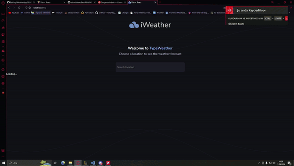
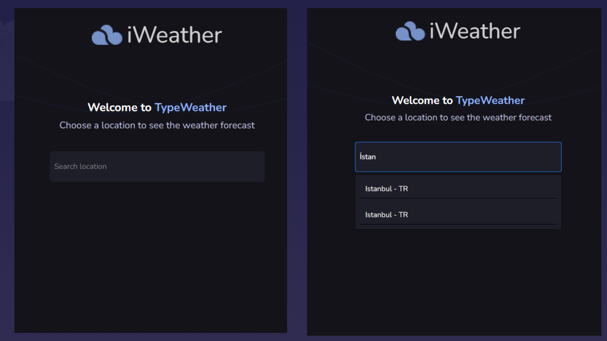
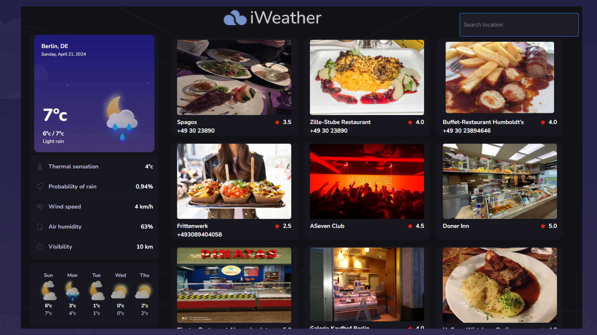

<h1 align="center">i-Weather-App</h1>

Read this README in: [Türkçe](README.md) | [English](README.en.md)


  <p align="center">
 
  </a>
    <br />
   <a href="https://github.com/emrahbyz/iWeatherApp"><strong>Source Code »</strong></a>
    <br />
    <br />
    <a href="https://i-weather-app-wine.vercel.app">Go to Project</a>
    ·
    <a href="https://github.com/emrahbyz/iWeatherApp/issues/new?labels=bug&template=bug-report---.md">Report Bug</a>
    ·
    <a href="https://github.com/emrahbyz/iWeatherApp/issues/new?labels=enhancement&template=feature-request---.md">Request Feature</a>
  </p>
</div>

<details>
  <summary>Contents</summary>
  <ol>
    <li>
      <a href="#about-the-project">About The Project</a>
      <ul>
        <li><a href="#key-features">Key Features</a></li>
        <li><a href="#additional-packages">Additional Packages</a></li>
      </ul>
    </li>
    <li>
      <a href="#installation">Installation</a>
    </li>
    <li><a href="#usage">Usage</a></li>
    <li><a href="#roadmap">Roadmap</a></li>
    <li><a href="#contact">Contact</a></li>
    <li><a href="#acknowledgements">Acknowledgements</a></li>
  </ol>
</details>

## About The Project

<p align="center">
  
</p>

<p align="center"> 
  
  
</p>

### Key Features

- **Weather Information:** View real-time weather data (temperature, wind speed, humidity, pressure) and detailed weekly forecasts.

- **City Exploration:** Search any city worldwide and explore top restaurants along with weather information.

- **Restaurant Discovery:** Find popular restaurants based on user ratings, cuisine types, and photos (requires restaurant API integration).

- **Responsive Design:** The web application is designed to seamlessly adapt to different devices (mobile, tablet, desktop).

### Built With

This project is built using the following main technologies:

<p align="center">
  
  
  
</p>

- **React**: JavaScript library used for building the user interface.
- **Vite**: JavaScript tool that provides a fast and modern development environment.
- **Tailwind CSS**: Fast and flexible CSS framework.

### Additional Packages

The project utilizes the following additional packages and libraries:

- **react-select**: Provides a user-friendly city selection dropdown menu.
- **phosphor-react**: Used for modern and customizable weather icons.
- **debounce-promise**: Optimizes performance by quickly handling user interactions.
- **axios**: Makes HTTP requests to fetch weather data.
- **react-icons**: Provides access to popular icon sets like Font Awesome and Material Design.
- **react-geolocated**: Automatically determines the user's location for fetching weather data.

### Installation

1. Clone the repository:

   ```bash
   git clone https://github.com/emrahbyz/iWeatherApp.git
   ```

2. Navigate to the project directory:

   ```bash
   cd iWeatherApp
   ```

3. Install dependencies:

   ```bash
   npm install
   ```

4. (Optional) Set up your restaurant API key in the configuration file (details available in the code).

5. Start the development server:

   ```bash
   npm run dev
   ```

This will typically start the application at [http://localhost:3000](http://localhost:3000) in your default web browser.

## Usage

i-Weather-App is a user-friendly web application for viewing weather information and exploring cities. Here are the application features:

- **View Weather Information**:

  - Enter the name of the city you want to view weather information for in the search bar, or allow location services to detect your current location.
  - Details such as temperature, wind speed, humidity, pressure, and weekly forecast will be displayed.

- **City Exploration**:

  - Explore cities using a user-friendly interface.

- **Restaurant Discovery**:
  - Discover popular restaurants in the city.

The application displays real-time weather information and allows users to explore restaurants in cities. With map functionality, users can visually explore cities and access weather details.

## Roadmap

### Weather Alerts

- [ ] Implement weather alerts for severe weather conditions.

### Visual City Exploration

- [ ] Add map functionality for visual city exploration.

### User Authentication Features

- [ ] Implement user authentication for personalized experiences and saved locations.

### Multi-Language Support

- [x] Add multi-language support.
  - [ ] Chinese
  - [ ] Spanish
  - [x] English

## Contributing

Contributions to i-Weather-App are welcome! Fork the repository, create pull requests with your enhancements, or report issues to help us improve this application.

## Contact

Email: [song.emrah@gmail.com](mailto:song.emrah@gmail.com)

## Acknowledgements

Special thanks to [@ozcanzaferayan](https://github.com/ozcanzaferayan) and the [React-Staj-2024](https://github.com/React-Staj-2024) team for their contributions to this project.
