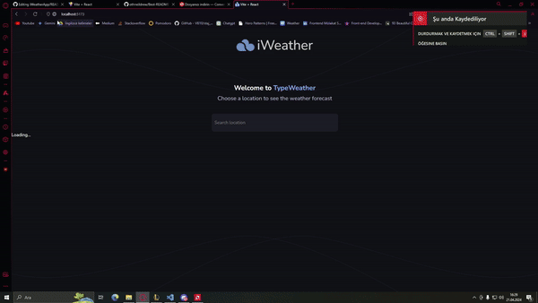
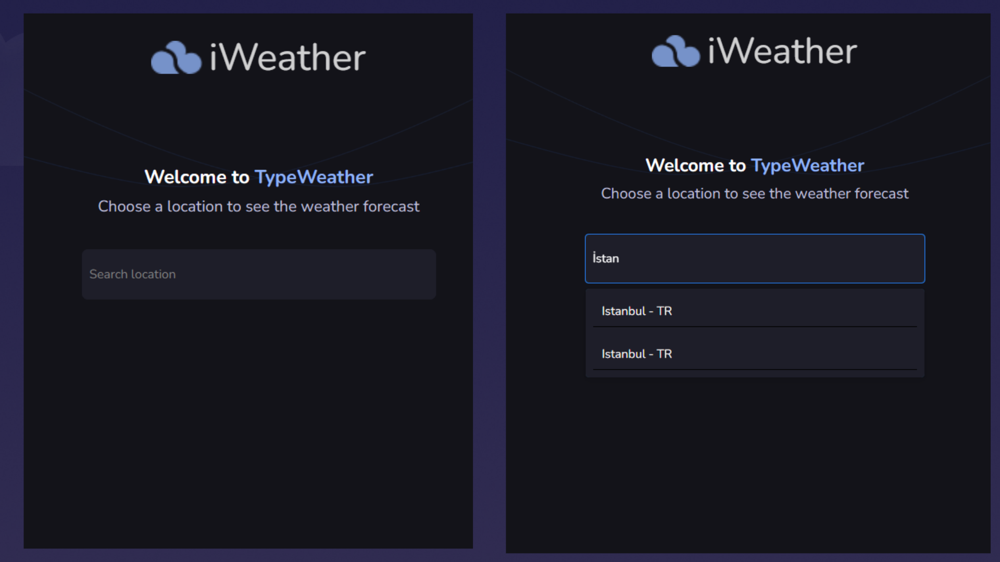

<h1 align="center">i-Weather-App</h1>
  <p align="center">
 
  </a>
    <br />
   <a href="https://github.com/emrahbyz/iWeatherApp"><strong>Kaynak Kodları »</strong></a>
    <br />
    <br />
    <a href="https://i-weather-app-wine.vercel.app">Projeye Git</a>
    ·
    <a href="https://github.com/emrahbyz/iWeatherApp/issues/new?labels=bug&template=bug-report---.md">Report Bug</a>
    ·
    <a href="https://github.com/emrahbyz/iWeatherApp/issues/new?labels=enhancement&template=feature-request---.md">İstek</a>
  </p>
</div>

<details>
  <summary>İçerik</summary>
  <ol>
    <li>
      <a href="#about-the-project">Proje Hakkında</a>
      <ul>
        <li><a href="#built-with">Built</a></li>
      </ul>
    </li>
    <li>
      <a href="#getting-started">Başlarken</a>
      <ul>
        <li><a href="#prerequisites">ÖnKoşullar</a></li>
        <li><a href="#installation">Kurulum</a></li>
      </ul>
    </li>
    <li><a href="#usage">Kullanım</a></li>
    <li><a href="#roadmap">Roadmap</a></li>
    <li><a href="#contact">İletişim</a></li>
    <li><a href="#acknowledgments">Teşekkür</a></li>
  </ol>
</details>

## Proje Hakkında


<p align="center">
  
</p>

 <p>
  
  
 
</p>


### Ana Özellikler

- **Hava Durumu Bilgisi:** Gerçek zamanlı hava durumu verilerini (sıcaklık, rüzgar hızı, nem, basınç) ve haftalık detaylı tahminleri görüntüleyin.

- **Şehir Keşfi:** Dünyanın herhangi bir şehrini arayın ve hava durumunun yanı sıra en iyi restoranlarını keşfedin.

- **Restoran Keşfi:** Kullanıcı puanlarına, mutfak türlerine ve fotoğraflara göre popüler restoranları bulun (restoran API entegrasyonu gerektirir).

- **Duyarlı Tasarım:** Web uygulaması, farklı cihazlarda (telefon, tablet, masaüstü) sorunsuz çalışacak şekilde duyarlı bir tasarıma sahiptir.

### Kullanılan Teknolojiler

Bu projeyi oluşturmak için şu ana teknolojiler kullanılmıştır:

<p align="center">
  
  
  
</p>

- **React**: Kullanıcı arayüzü geliştirmek için kullanılan JavaScript kütüphanesi.
- **Vite**: Hızlı ve modern bir geliştirme ortamı sağlayan JavaScript aracı.
- **Tailwind CSS**: Hızlı ve esnek bir CSS framework'ü.

### Ek Paketler

Bu projede kullanılan ek paketler ve kütüphaneler:

- **react-select**: Kullanıcı dostu şehir seçimi açılır menüsü sağlar.
- **phosphor-react**: Modern ve özelleştirilebilir hava durumu simgeleri için kullanılır.
- **debounce-promise**: Kullanıcı etkileşimlerini hızla ele alarak performansı optimize eder.
- **axios**: Hava durumu verilerini almak için HTTP istekleri yapar.
- **react-icons**: Font Awesome ve Material Design gibi popüler simge setlerine erişim sağlar.
- **react-geolocated**: Kullanıcının konumunu otomatik olarak belirleyerek hava durumu verilerini alma işlemi için kullanılır.

### Kurulum

1. Depoyu klonlayın:

    ```bash
    git clone https://github.com/emrahbyz/iWeatherApp.git
    ```

2. Proje dizinine gidin:

    ```bash
    cd iWeatherApp
    ```

3. Bağımlılıkları yükleyin:

    ```bash
    npm install
    ```

4. (Opsiyonel) Restoran API anahtarınızı konfigürasyon dosyasında ayarlayın (detaylar kod içinde mevcuttur).

5. Geliştirme sunucusunu başlatın:

    ```bash
    npm run dev
    ```

Bu işlem, uygulamayı genellikle [http://localhost:3000](http://localhost:3000) adresinde varsayılan web tarayıcınızda başlatacaktır.


Kullanım
i-Weather-App, kullanıcı dostu bir arayüz sunar:

Hava durumunu görüntülemek istediğiniz şehrin adını arama çubuğuna girin veya konum hizmetlerinin bulunduğunuz yeri algılamasına izin verin.
Sıcaklık, rüzgar hızı, nem, basınç ve haftalık tahmin gibi hava durumu detayları görüntülenecektir.
Kullanıcı puanlarına, mutfak türlerine ve fotoğraflara göre şehrin popüler restoranlarını keşfedin (restoran API entegrasyonu gerektirir).
Yol Haritası
Öneri ve otomatik tamamlama ile şehir arama işlevselliğini geliştirin.
Şiddetli hava koşullarında bildirim sağlayan hava durumu uyarıları ekleyin.
Görsel şehir keşfi için harita işlevsellikleri ekleyin.
Kişiselleştirilmiş deneyimler ve kaydedilen konumlar için kullanıcı kimlik doğrulama özellikleri ekleyin.
Katkıda Bulunma
i-Weather-App'i geliştirmek için katkılarınızı memnuniyetle karşılıyoruz! Depoyu forklayın, geliştirmelerinizle pull request'ler oluşturun veya sorunları bildirerek bu uygulamayı daha da iyi hale getirmemize yardımcı olun.

Yukarıdaki README dosyası, i-Weather-App projesinin ana özelliklerini, kullanılan teknolojileri, kurulum talimatlarını ve katkıda bulunma yolunu açıklayarak projenin daha iyi anlaşılmasını sağlar. Uygulamanızın gelişimi için başarılar dilerim!
